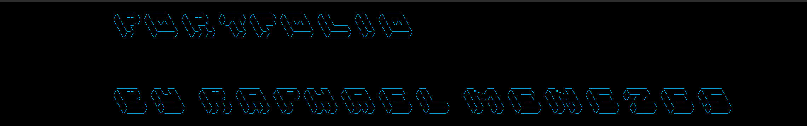

# Exercices and little projects!



## Descrição

**Exercices and little projects!** é um repo que integra e une diferentes aplicativos e funcionalidades feitos por mim em exercicios e projetos stand-alone. Este projeto foi desenvolvido com o objetivo de criar um portfolio do meu desempenho ate aqui em parte (alem de outros projetos que tenho no github).

## Funcionalidades

- **Centralização de Projetos**: Reúne diferentes ferramentas e funcionalidades em um único local, facilitando o acesso e a gestão de projetos diversos.

- **Expansível**: Projetado com a flexibilidade em mente, novos projetos podem ser adicionados ao site à medida que são desenvolvidos, ampliando continuamente as funcionalidades oferecidas.

## Requisitos

- Python 3.x
- Django 4.x
- Turtle ?.x

## Instalação para ver o site

1. Clone este repositório:
    ```bash
    git clone https://github.com/raphaelmenezes/sitePortfolio.git
    ```
2. Navegue até o diretório do projeto:
    ```bash
    cd sitePortfolio
    ```
3. Crie um ambiente virtual (opcional, mas recomendado):
    ```bash
    python -m venv env
    source env/bin/activate  # Linux/Mac
    .\env\Scripts\activate  # Windows
    ```
4. Instale o Django e as dependências necessárias:
    ```bash
    pip install django
    pip install -r requirements.txt
    ```
5. Execute as migrações do Django:
    ```bash
    python manage.py migrate
    ```
6. Inicie o servidor de desenvolvimento:
    ```bash
    python manage.py runserver
    ```
7. Acesse o site no seu navegador em `http://127.0.0.1:8000`.

## Como Usar

Depois de configurar e iniciar o servidor, você pode acessar as diferentes ferramentas disponíveis no site através da página inicial. Cada projeto pode ser acessado por meio dos botões de navegação na página principal.


## Instalação para os outros projetos:

1. Clone este repositório:
    ```bash
    git clone https://github.com/raphaelmenezes/sitePortfolio.git
    ```
2. Navegue até o diretório do projeto:
    ```bash
    cd sitePortfolio/Other_Projects_in_python
    ```
3. Crie um ambiente virtual (opcional, mas recomendado):
    ```bash
    python -m venv env
    source env/bin/activate  # Linux/Mac
    .\env\Scripts\activate  # Windows
    ```
4. Execute os scripts em uma IDE ou direto via terminal:
    ```bash
    python 'Cypher ceaser.py'
    python hangman.py
    etc
    ```
